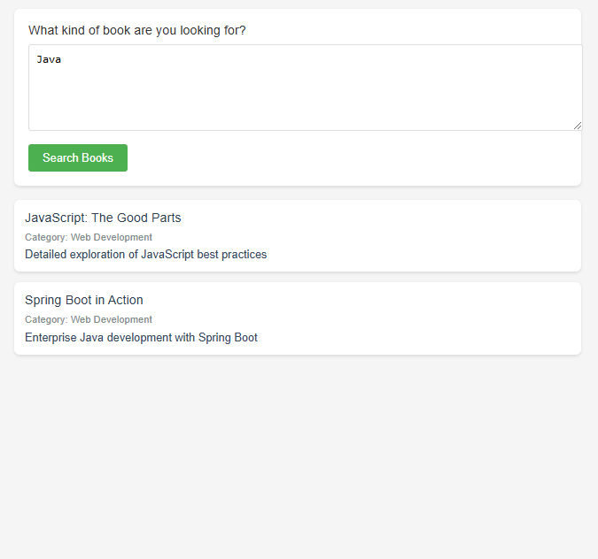

# Book Search System 📚
A PHP-based book search system with dynamic search capabilities and responsive interface.



## ✨ Features
- Natural language search queries
- Multi-field search (title, category, description)
- Real-time search results
- Clean, responsive interface
- Secure database handling
- Multiple book categories support

## 🛠️ Technologies Used
- PHP 7.4+
- MySQL
- HTML5
- CSS3
- PDO/MySQLi
- Prepared Statements

## 📁 Project Structure
```
Book Search System
│
├── search_form.php
├── README.md
│
└── database/
    └── library_db.sql
```

## 🔍 Search System
1. Enter search query in text area
2. System searches across:
   - Book titles
   - Categories
   - Descriptions
3. Results display instantly
4. Multiple keyword support

## 🚀 Getting Started
1. Install XAMPP:
```bash
# Download and install from
https://www.apachefriends.org/
```

2. Import Database:
```sql
-- Create database and table
CREATE DATABASE library_db;
USE library_db;
CREATE TABLE books (
    id INT AUTO_INCREMENT PRIMARY KEY,
    title VARCHAR(255) NOT NULL,
    category VARCHAR(100) NOT NULL,
    description TEXT,
    created_at TIMESTAMP DEFAULT CURRENT_TIMESTAMP
);
```

3. Place files in XAMPP directory:
```bash
C:/xampp/htdocs/book-search/
```

4. Start Apache and MySQL:
```bash
# Using XAMPP Control Panel
Start Apache Module
Start MySQL Module
```

5. Access the search system:
```bash
http://localhost/book-search/search_form.php
```

## 🔒 Security Features
- Prepared statements
- Input sanitization
- SQL injection prevention
- XSS protection

## 🔧 Database Configuration
Edit in `search_form.php`:
```php
$host = "localhost";
$username = "root";
$password = "";
$database = "library_db";
```

## 📝 License
This project is open source

## 🐛 Known Issues
- No pagination for large result sets
- Basic search algorithm
- Single language support